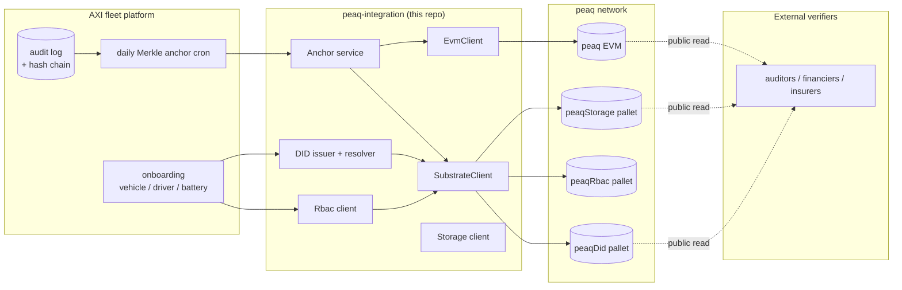
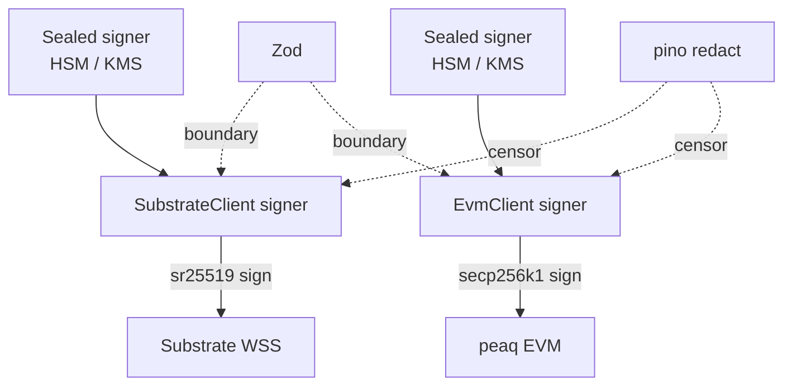

<p align="center">
  
</p>

<p align="center">
  
  
  
  
  
</p>

# peaq-integration

The TypeScript code AXI Mobility uses to talk to the peaq blockchain. One typed library, one CLI.

The smart contracts these tools call from the other side live in [`peaq-contracts`](https://github.com/aximobility/peaq-contracts).

---

## What this does

Four jobs.

1. **Issue identities.** Each new vehicle, driver, battery, or tracker gets a `did:peaq:...` document on-chain. Anyone can resolve it.
2. **Anchor audit logs.** Once a day, our internal audit chain gets summarised into a Merkle root and submitted to peaq. Auditors can re-derive any event from yesterday.
3. **Manage roles.** Operator permissions are recorded on-chain via `peaqRbac` so credential checks stay verifiable across deployments.
4. **Read state back.** When an insurer or regulator needs to confirm something, they query peaq directly — not us.

This repo holds **only** the integration. The fleet platform that uses it lives separately. Both sides are open source.

---

## Architecture



Two clients in one library:

- **SubstrateClient** (Polkadot.js) talks to peaq's pallets (`peaqDid`, `peaqStorage`, `peaqRbac`).
- **EvmClient** (viem) talks to peaq EVM for daily anchor transactions.

Both share retry, structured logging, and Zod-validated env config.

---

## Quick start

You need **Node 20+** and **pnpm 9+**.

```bash
git clone https://github.com/aximobility/peaq-integration
cd peaq-integration
pnpm install
cp .env.example .env.local
# Set PEAQ_NETWORK=agung and PEAQ_SIGNER_MNEMONIC=...
pnpm peaq status
```

The `status` command prints a network summary plus a live health check.

### Submit your first anchor (against Agung)

```bash
echo '["b94d27b9934d3e08a52e52d7da7dabfac484efe37a5380ee9088f7ace2efcde9"]' \
  > /tmp/leaves.json

PEAQ_NETWORK=agung \
PEAQ_EVM_PRIVATE_KEY=0x... \
pnpm peaq anchor submit \
  --workspace-id roam \
  --anchor-date 2026-05-07 \
  --leaves /tmp/leaves.json \
  --via evm
```

Verify it later from any machine:

```bash
pnpm peaq anchor verify-on-chain \
  --tx-hash 0x... \
  --root <root-from-submit>
```

### Need test tokens?

Join the peaq Discord, find `#agung-faucet`, run `!send <your-address>`. The faucet drips 1 AGNG per request per hour. Mainnet PEAQ comes from exchanges or your treasury wallet.

---

## What's in here

```
peaq-integration/
├── packages/peaq-integration/    The library — see its own README
├── apps/peaq-cli/                The operator CLI — see its own README
├── infra/docker/Dockerfile       Distroless image, runs as non-root
├── docs/
│   ├── ARCHITECTURE.md           Diagrams + flows + lifecycle
│   └── VERIFIED_SPECS.md         Every fact with the source URL
└── tests/load/                   k6 load tests
```

The library's API is documented in [`packages/peaq-integration/README.md`](packages/peaq-integration/README.md). The CLI's commands are documented in [`apps/peaq-cli/README.md`](apps/peaq-cli/README.md).

---

## Networks

| Property | Mainnet | Agung (testnet) |
|---|---|---|
| EVM chain ID | **3338** | **9990** |
| Native currency | PEAQ | AGNG |
| Mainnet launch | 12 Nov 2024 | (testnet) |
| Primary WSS | `wss://quicknode1.peaq.xyz` (1, 2, 3) | `wss://wss-async.agung.peaq.network` |
| Primary HTTPS | `https://quicknode1.peaq.xyz` (1, 2, 3) | `https://peaq-agung.api.onfinality.io/public` |
| Fallback | `wss://peaq-rpc.publicnode.com` / `https://peaq-rpc.publicnode.com` | -- |
| Block explorer | https://peaq.subscan.io | https://agung-testnet.subscan.io |
| Faucet | exchanges or treasury | Discord `#agung-faucet` |

Sources for every value above are in [`docs/VERIFIED_SPECS.md`](docs/VERIFIED_SPECS.md).

---

## Engineering principles

We follow a small set of rules consistently. They're more important than any single feature.

| Rule | Reason |
|---|---|
| Two clients (Substrate + EVM) | peaq supports both. Some pallets only exist on Substrate; EVM gives easier tooling for anchor transactions. |
| Default endpoints from official peaq docs | First call works without configuration. |
| Retry with exponential backoff and jitter | RPC endpoints hiccup. Permanent errors (insufficient balance, malformed tx) skip retry. |
| Zod validation at every public boundary | One Zod failure beats a confusing crash deep inside `@polkadot/api`. |
| pino with secret redaction | Mnemonics, private keys, bearer tokens never reach disk or stdout. |
| No `console.log` anywhere | Biome rule. CI fails the PR. |
| No `as any` anywhere | Biome rule. CI fails the PR. |
| Distroless runtime image | No shell, no package manager. Smaller attack surface. |
| GitHub OIDC for releases | No long-lived AWS or registry credentials in CI. |
| SBOM (CycloneDX) on every release | Supply-chain auditability. |

---

## Security model



- **Keys never live in env files in production.** They sit in AWS Secrets Manager or HashiCorp Vault, get decrypted via a KMS-backed key, and zero out from memory after `connect()`.
- **Substrate and EVM use separate keys.** Compromising one path does not compromise the other.
- **Every public function validates inputs with Zod** before issuing an extrinsic.
- **The retry loop short-circuits on permanent errors.** No gas burned on transactions that won't succeed regardless of retry.
- **Every successful submission returns a typed receipt** (txHash + blockNumber) so the caller can persist proof.
- **The logger redacts sensitive fields by default** — `*.privateKey`, `*.signerMnemonic`, `*.mnemonic`, `*.password`, `*.secret`, `*.token`, `*.bearer`, `*.authorization`.

---

## Operations

### Health check (good for k8s liveness/readiness)

```bash
pnpm peaq health
# Prints JSON. Exits 0 if Substrate + EVM are both up. Exits 1 otherwise.
```

### Run as a container

```bash
docker build -f infra/docker/Dockerfile -t peaq-integration .

docker run --rm \
  -e PEAQ_NETWORK=agung \
  -e PEAQ_EVM_PRIVATE_KEY=0x... \
  -e PEAQ_SIGNER_MNEMONIC="..." \
  peaq-integration status
```

### CI and release

- Push to `main` → CI runs lint, typecheck, tests, semgrep, gitleaks, trivy, and SBOM generation.
- Push a `vX.Y.Z` tag → release builds and pushes `ghcr.io/aximobility/peaq-integration:X.Y.Z` (with provenance and SBOM attached).

---

## Tests

```bash
pnpm test
```

Unit tests cover:

- Network specs (chain IDs, currency symbols, RPC URL parseability)
- Merkle tree (build, prove, verify)
- Retry classifier (retryable vs permanent)
- DID method (charset, prefix)
- DID document Zod schema (acceptance + rejection)

Live tests against Agung exist as an opt-in suite (`PEAQ_LIVE_TESTS=1`). They submit one `peaqDid.addAttribute` and one `peaqStorage.addItem` against Agung, verify the receipt, then clean up.

---

## What we verified vs what we asked peaq

We split every fact about peaq into two lists in [`docs/VERIFIED_SPECS.md`](docs/VERIFIED_SPECS.md).

- **Verified from official docs** (with source URLs): chain IDs, RPC endpoints, SDK package, DID method spec, pallet names + extrinsic shapes, currency symbols, mainnet launch date, faucet location, latest node release.
- **Could not verify** (asked peaq team directly): exact extrinsic fees in PEAQ/USD, DePIN bulk-write pricing tier, strict W3C JSON-LD VC compliance, current validator/collator decentralisation metrics.

For technical reviewers: every code path that touches peaq cites which spec or doc page it implements. Every constant (chain IDs, ss58 prefix, default RPC URLs) lives in `packages/peaq-integration/src/chain/networks.ts` and is tested.

---

## License

Apache-2.0. © AXI Mobility 2026.

The peaq integration is open source under the same licence as peaq itself. See [`LICENSE`](LICENSE).
