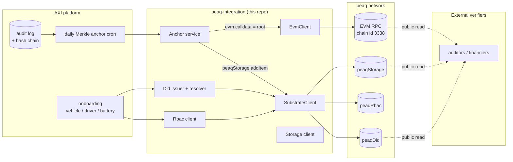
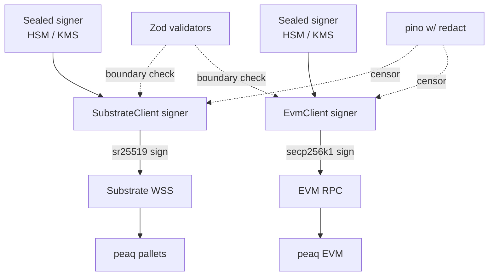

# peaq-integration

> Production-grade peaq blockchain integration for AXI Mobility. Anchors fleet operations on peaq, issues + resolves `did:peaq:` identities, and wraps the `peaqDid` / `peaqStorage` / `peaqRbac` pallets behind a small, typed, retry-aware library.

This repo holds **only** the peaq integration. It is consumed by the AXI platform monorepo (`aximobility/platform`) and can also stand alone as a CLI for ops or a Docker image.

---

## What it does (in one paragraph)

AXI runs a fleet platform. Every state change writes an audit row that hashes the previous one (a tamper-evident chain). Once a day, a Merkle root over that chain gets anchored to peaq. New vehicles, drivers, batteries, and trackers receive `did:peaq:` documents. Roles and permissions for operators are recorded on-chain via `peaqRbac` so credential checks stay verifiable across deployments. This repo is the code that talks to peaq for all of that.

---

## Architecture



Two clients, one library: a Substrate WSS client (Polkadot.js) for the peaq pallets, an EVM client (viem) for calldata-anchor transactions. They share a retry+backoff helper, a structured pino logger, and a Zod-validated env layer.

---

## Quick start

You need **Node 20+** and **pnpm 9+**.

```bash
git clone https://github.com/aximobility/peaq-integration.git
cd peaq-integration
pnpm install
cp .env.example .env.local
# fill PEAQ_NETWORK + (for agung) PEAQ_SIGNER_MNEMONIC
pnpm --filter @aximobility/peaq-cli dev status
```

You should see a network summary plus a live health check against the configured RPC + WSS.

### Get test tokens (agung)

Per peaq docs: join the peaq Discord, find the `#agung-faucet` channel, run `!send <your-address>`. The faucet drips 1 AGNG per request per hour. Mainnet PEAQ is acquired from exchanges or transferred from a treasury wallet.

### A minimal anchor against agung

```bash
echo '["b94d27b9934d3e08a52e52d7da7dabfac484efe37a5380ee9088f7ace2efcde9","2ca7d6362c93cf6f7e44d1c1d2e7a92a8e16a31e5ad3ec1e8fce1f6f8b4e3c34"]' > /tmp/leaves.json

PEAQ_NETWORK=agung \
  PEAQ_EVM_PRIVATE_KEY=0x... \
  pnpm --filter @aximobility/peaq-cli dev anchor submit \
  --workspace-id roam \
  --anchor-date 2026-05-05 \
  --leaves /tmp/leaves.json \
  --via evm
```

Then verify any time later from any peaq RPC:

```bash
pnpm --filter @aximobility/peaq-cli dev anchor verify-on-chain \
  --tx-hash 0x... \
  --root <root-from-submit-output>
```

---

## What you get

```
peaq-integration/
├── packages/peaq-integration/      The library (TypeScript, strict)
│   └── src/
│       ├── chain/                  SubstrateClient + EvmClient + retry
│       ├── did/                    DID method + issuer + resolver
│       ├── storage/                peaqStorage pallet
│       ├── rbac/                   peaqRbac pallet
│       ├── anchor/                 Merkle tree + anchor service + verifier
│       ├── env.ts                  Zod-validated env
│       └── logger.ts               pino structured logging w/ secret redaction
│
├── apps/peaq-cli/                  Operator CLI: did / anchor / storage / status / health
├── infra/docker/Dockerfile         Multi-stage distroless image (non-root)
├── docs/
│   ├── ARCHITECTURE.md             Diagrams + flow + lifecycle
│   └── VERIFIED_SPECS.md           Every fact + source URL
├── .github/workflows/              CI (lint + typecheck + test + semgrep + gitleaks + trivy + syft)
├── tsconfig.json                   strict + noUncheckedIndexedAccess + exactOptionalPropertyTypes
├── biome.json                      Linter + formatter (no console.log, no `as any`)
└── README.md
```

---

## API at a glance

```ts
import {
  SubstrateClient,
  EvmClient,
  PeaqDidIssuer,
  PeaqDidResolver,
  PeaqStorageClient,
  PeaqRbacClient,
  PeaqAnchorService,
  resolveNetwork,
} from "@aximobility/peaq-integration";

const network = resolveNetwork(process.env.PEAQ_NETWORK); // "mainnet" | "agung"

const substrate = new SubstrateClient({ network, signerMnemonic: process.env.PEAQ_SIGNER_MNEMONIC });
await substrate.connect();

const evm = new EvmClient({ network, privateKey: process.env.PEAQ_EVM_PRIVATE_KEY as `0x${string}` });

// Issue a DID document
const issuer = new PeaqDidIssuer({ substrate });
const receipt = await issuer.writeDocument("did:peaq:5GrwvaEF...", {
  id: "did:peaq:5GrwvaEF...",
  controller: "did:peaq:5GrwvaEF...",
  verificationMethod: [{ id: "...", type: "Sr25519VerificationKey2020", controller: "...", publicKeyHex: "0x..." }],
});

// Anchor a Merkle root via the EVM precompile
const anchor = new PeaqAnchorService({ substrate, evm });
const evmReceipt = await anchor.submitViaEvm({
  workspaceId: "roam",
  anchorDate: "2026-05-05",
  leafHashes: [/* 64-hex per leaf */],
});

// Or via peaqStorage on Substrate
const subReceipt = await anchor.submitViaSubstrate({
  workspaceId: "roam",
  anchorDate: "2026-05-05",
  leafHashes: [/* 64-hex per leaf */],
});
```

---

## CLI commands

```bash
peaq status                 # network summary + live health check
peaq health                 # exit 0 only if substrate + EVM are healthy

peaq did add-attribute --did did:peaq:... --name doc --value '{"id":"did:peaq:..."}'
peaq did read-attribute did:peaq:... doc
peaq did write-doc did:peaq:...           # JSON document via stdin
peaq did resolve <did|address>            # W3C-style resolution result

peaq anchor preview --leaves leaves.json
peaq anchor submit --workspace-id roam --anchor-date 2026-05-05 --leaves leaves.json --via evm
peaq anchor verify-on-chain --tx-hash 0x... --root <64-hex>

peaq storage put --type "axi.profile" --value '{"foo":"bar"}'
peaq storage update --type "axi.profile" --value '{"foo":"baz"}'
peaq storage get <owner-address> "axi.profile"
```

---

## Engineering decisions (and why)

| Decision | Why |
|---|---|
| **Two clients (Substrate + EVM)** | peaq exposes both; some pallets only on Substrate (`peaqDid`/`peaqRbac`/`peaqStorage`), EVM gives lower-friction tooling for calldata anchors |
| **Default endpoints from official docs** | First-call works without any URL config |
| **Retry with exponential backoff + jitter** | RPCs hiccup; permanent errors (insufficient balance, malformed tx) skip retry |
| **Zod at every boundary** | One Zod failure beats a misleading runtime crash deep in `@polkadot/api` |
| **pino with secret redaction** | Mnemonics, private keys, bearer tokens never reach disk or stdout |
| **No `console.log` anywhere** | Biome rule enforces; CI fails the PR |
| **No `as any`** | Biome rule enforces |
| **Distroless runtime image** | No shell, no package manager, smaller attack surface |
| **GitHub OIDC for releases** | No long-lived AWS / registry credentials in CI |
| **SBOM (CycloneDX) on every release** | Supply-chain auditability |
| **Trivy + semgrep + gitleaks in CI** | Catch CVEs, common SAST issues, accidental secret commits |

---

## Security model



- **Mnemonic / private key never live in env files in production.** Production reads them from AWS Secrets Manager / HashiCorp Vault, decrypts via a KMS-backed key, and zeros memory after `connect()`.
- **Signer separation.** Substrate sr25519 and EVM secp256k1 keys are independent. Compromise of one path is contained.
- **Default-deny inputs.** Every public function validates with Zod before issuing an extrinsic.
- **Permanent-error short-circuit.** Retry loop never burns gas or budget on errors that won't change with retry (`balance too low`, `priority too low`, `invalid transaction`).
- **Receipt contracts.** Every successful submission returns a typed receipt with txHash + blockNumber so the caller can persist the proof.
- **Logger redaction.** `pino`'s redact paths cover `*.privateKey`, `*.signerMnemonic`, `*.mnemonic`, `*.password`, `*.secret`, `*.token`, `*.bearer`, `*.authorization` by default.

---

## Networks

This integration ships specs for both peaq networks. See [docs/VERIFIED_SPECS.md](docs/VERIFIED_SPECS.md) for sources.

| Property | mainnet | agung (testnet) |
|---|---|---|
| EVM chain ID | **3338** | **9990** |
| Native currency | PEAQ | AGNG |
| Mainnet launch | 12 Nov 2024 | (testnet) |
| ParaID (Polkadot) | 3338 | n/a |
| Default WSS | `wss://peaq-rpc.publicnode.com` | `wss://wss-async.agung.peaq.network` |
| Default HTTPS | `https://peaq-rpc.publicnode.com` | `https://peaq-agung.api.onfinality.io/public` |
| Block explorer | https://peaq.subscan.io | https://agung-testnet.subscan.io |
| Faucet | exchanges/treasury | Discord `#agung-faucet` |

---

## Verification status

We split every fact into "verified from official docs" or "could not verify, asked peaq team".

- ✅ **Verified** (with source URL) — chain IDs, RPC endpoints, SDK package, DID method spec, pallet names + extrinsic shapes, currency symbols, mainnet launch date, faucet location.
- ⚠ **Could not verify** — exact extrinsic fees in PEAQ/USD, DePIN bulk-write pricing, strict W3C JSON-LD VC compliance, current validator count.

Both lists, with source URLs, live in [docs/VERIFIED_SPECS.md](docs/VERIFIED_SPECS.md).

For technical review: every code path that touches peaq cites which spec or doc page it implements. Every constant (chain IDs, ss58 prefix, default RPC URLs) is in `src/chain/networks.ts` and tested.

---

## Operations

### Health probe (good for k8s liveness/readiness)

```bash
peaq health
# emits JSON. exits 0 if substrate + EVM are both up; 1 otherwise.
```

### Container

```bash
docker build -f infra/docker/Dockerfile -t peaq-integration .
docker run --rm \
  -e PEAQ_NETWORK=agung \
  -e PEAQ_EVM_PRIVATE_KEY=0x... \
  -e PEAQ_SIGNER_MNEMONIC="..." \
  peaq-integration status
```

### CI / Release

- `main` push → CI: lint + typecheck + test + semgrep + gitleaks + trivy + syft SBOM.
- Tag `vX.Y.Z` push → Release: build + push `ghcr.io/aximobility/peaq-integration:X.Y.Z` (provenance + SBOM attached).

---

## Tests

```bash
pnpm test
```

Unit tests cover:
- Network specs (chain IDs, currency symbols, endpoint URL parseability)
- Merkle tree + proof generation + verification
- Retry-with-backoff (retryable vs permanent classification)
- DID method validation (charset, prefix)
- DID document Zod schema (acceptance + rejection)

Live tests against agung (network-dependent, opt-in via `PEAQ_LIVE_TESTS=1`) are part of the integration test suite. They submit one `peaqDid.addAttribute` and one `peaqStorage.addItem` against agung, verify the receipt, then `removeAttribute` to clean up.

---

## License

Apache-2.0. © AXI Mobility 2026.

The peaq integration is open source and released under the same licence as peaq itself. See `LICENSE`.
