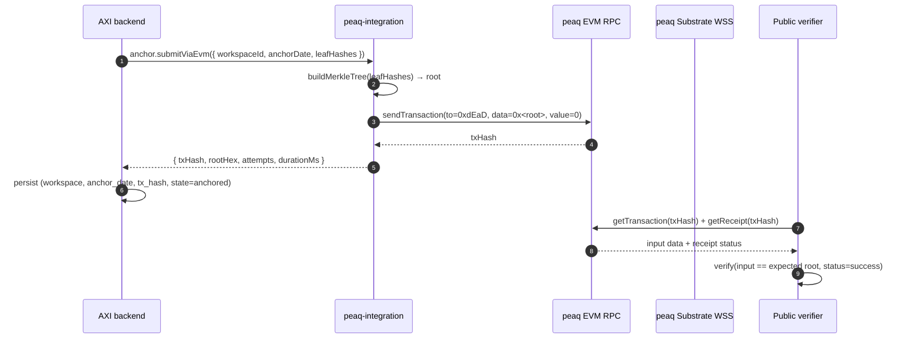
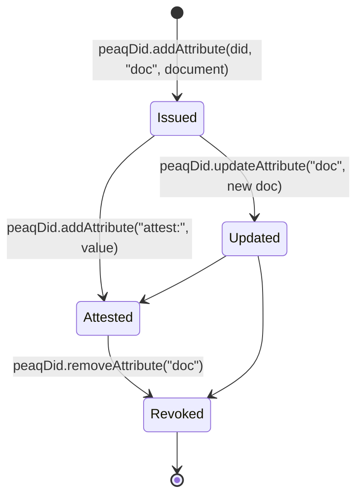
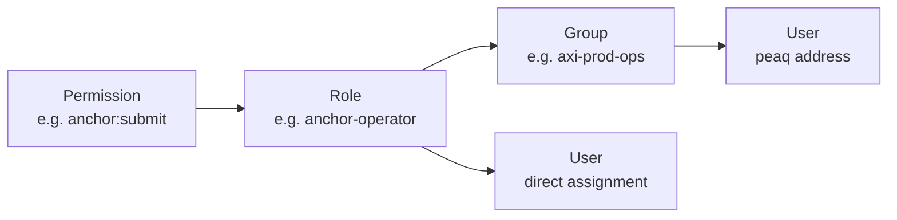

# Architecture

## What this integration does

AXI Mobility writes proofs of fleet operations to peaq. Three flows:

1. **Daily Merkle anchor** — every audit row from the day is hashed into a Merkle tree. The root goes on-chain (EVM calldata or `peaqStorage.addItem`). Auditors verify offline.
2. **DID issuance** — each Vehicle / Driver / Battery / Tracker gets a `did:peaq:…` document. Lifecycle events (created → in-service → second-life → recycled) are signed attribute updates.
3. **RBAC + Storage** — operator/financier/dealer roles attached on-chain so credential checks remain verifiable across deployments.

## Two clients, one signer surface

```mermaid
flowchart TB
  subgraph axi[AXI Platform]
    audit[(Audit log<br/>+ hash chain)]
    cron[Daily Merkle anchor cron]
    onb[Vehicle / Driver / Battery<br/>onboarding]
  end

  subgraph lib[peaq-integration library]
    sub[SubstrateClient<br/>Polkadot.js API]
    evm[EvmClient<br/>viem]
    did[PeaqDidIssuer / Resolver]
    storage[PeaqStorageClient]
    rbac[PeaqRbacClient]
    anchor[PeaqAnchorService]
    merkle[Merkle tree + verifier]
  end

  subgraph peaq[peaq network]
    pal_did[(peaqDid pallet)]
    pal_storage[(peaqStorage pallet)]
    pal_rbac[(peaqRbac pallet)]
    evm_chain[(EVM JSON-RPC<br/>chain id 3338)]
  end

  subgraph external[External]
    auditors[Auditors / financiers]
  end

  cron -->|leaves[]| anchor
  anchor -->|tree.root| merkle
  anchor -->|EVM calldata| evm
  anchor -->|substrate extrinsic| sub
  evm --> evm_chain
  sub --> pal_storage

  onb -->|create DID| did
  did -->|addAttribute| sub
  sub --> pal_did

  onb -->|role / group| rbac
  rbac --> sub
  sub --> pal_rbac

  audit --> cron
  evm_chain -.->|public read| auditors
  pal_storage -.->|public read| auditors
  pal_did -.->|public read| auditors
```

## Anchor flow (one day in the life)



## DID lifecycle



Attribute name conventions used by AXI:

| Name        | Purpose                                        |
|-------------|------------------------------------------------|
| `doc`       | Full DID document (JSON, schema-validated)     |
| `vc:<id>`   | A signed Verifiable Credential                 |
| `attest:<x>`| Attribute attestation (e.g. `attest:battery-soh`) |
| `lifecycle` | Lifecycle stage: factory-new / in-service / …  |

## RBAC model



Each addRole / addGroup / addPermission / assignment is a peaqRbac extrinsic. The library wraps each with input validation + retry + receipt parsing.

## Networks supported

| Property | mainnet | agung (testnet) |
|---|---|---|
| Chain ID (EVM) | 3338 | 9990 |
| Native currency | PEAQ | AGNG |
| ParaID | 3338 | n/a |
| Default WSS | `wss://peaq-rpc.publicnode.com` | `wss://wss-async.agung.peaq.network` |
| Default HTTPS | `https://peaq-rpc.publicnode.com` | `https://peaq-agung.api.onfinality.io/public` |
| Block explorer | https://peaq.subscan.io | https://agung-testnet.subscan.io |

Endpoints are pulled from the official peaq docs ([docs.peaq.xyz/build/getting-started/connecting-to-peaq](https://docs.peaq.xyz/build/getting-started/connecting-to-peaq)). Override per-deploy via `PEAQ_WSS_URL` / `PEAQ_HTTPS_URL`.
